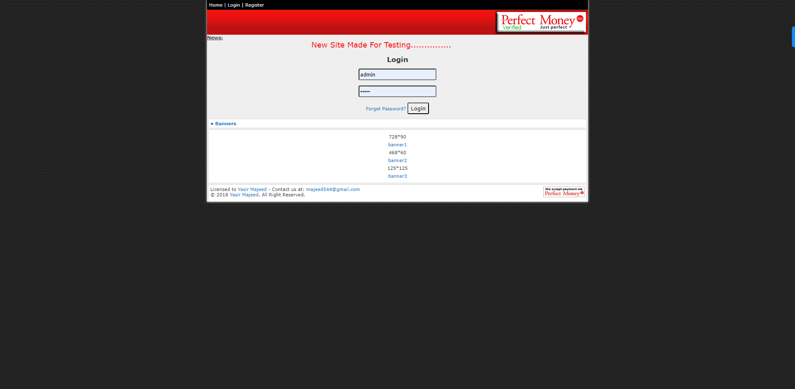
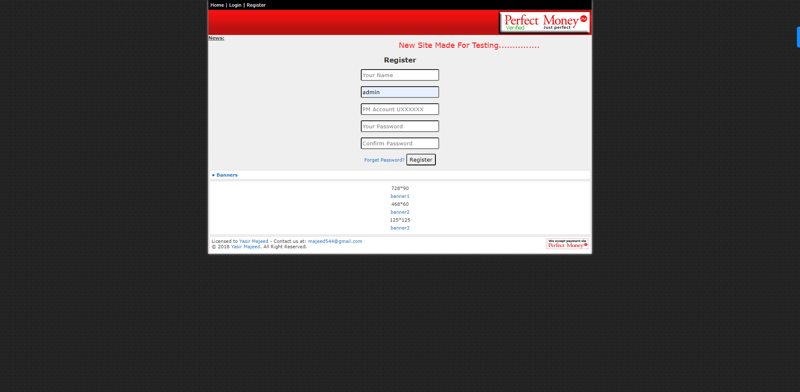
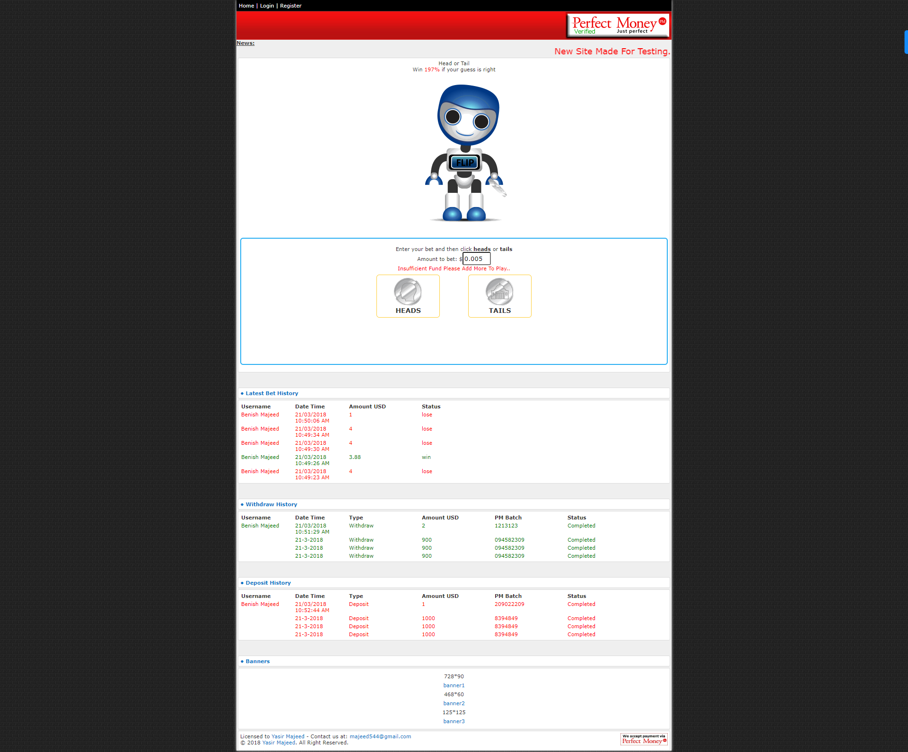

# Headtail Betting Game

Headtail Betting Game is a web-based application that offers an exciting betting experience for users. Players can place bets on a simple game of head or tail, where they predict the outcome of a coin toss. The game uses Perfect Money as the payment method for placing bets and managing winnings.

## How the Game Works

1. **Registration:**
   - Users need to create an account on the website to participate in the betting game.
   - Account registration requires basic information like name, email, and password.

2. **Deposit Funds:**
   - After registration, players can deposit funds into their accounts using Perfect Money.
   - Deposited funds will be used for placing bets and receiving winnings.

3. **Place Bets:**
   - Players can select the amount they want to bet on either "head" or "tail."
   - The betting amount will be deducted from their account balance.

4. **Coin Toss:**
   - The game randomly performs a coin toss (virtual coin flip) to determine the outcome.

5. **Winning Calculation:**
   - If the player's prediction matches the actual outcome, they win the amount they bet multiplied by the odds.
   - If the prediction is incorrect, the bet amount is lost.

6. **Withdraw Winnings:**
   - Players can withdraw their winnings to their Perfect Money account.
   - Withdrawal requests are processed securely and promptly.

## Technology Stack

The application is built using the following technologies:

- **Backend:**
  - PHP: Server-side scripting language to handle backend logic, user authentication, and payment integration with Perfect Money.

- **Frontend:**
  - HTML: Markup language for structuring the web pages.
  - CSS: Stylesheet language for styling the web pages.
  - JavaScript: Scripting language to add interactivity to the application.

- **Payment Integration:**
  - Perfect Money API: Integration with Perfect Money's payment gateway to handle deposits and withdrawals.

## Installation and Setup

1. Clone the repository:
2. Configure Perfect Money API:
3. Obtain the necessary API credentials from Perfect Money for payment integration.
4. Update the API credentials in the relevant PHP files for deposit and withdrawal operations.
5. Deploy the application:
6. Upload the project files to your web server with PHP support.
7. Access the application:
Open your web browser and visit the URL where you deployed the application.

